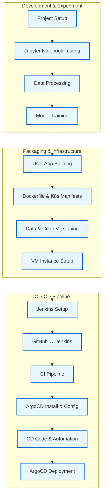

## EffiSense: End-to-End MLOps Pipeline for Machine Efficiency Prediction

EffiSense is a complete MLOps pipeline that predicts the **efficiency status (High | Medium | Low)** of industrial machines using intelligent manufacturing data.

It features a fully automated CI/CD setup using **Jenkins**, **ArgoCD**, **Docker**, **Kubernetes**, and **GitHub Webhooks** for seamless deployment.

---

## 🏛️ Project Structure
```
EffiSense/
├── app.py                  # Flask app with prediction logic
├── src/
│   ├── data_processing.py   # Preprocessing pipeline
│   ├── model_training.py    # Model training & evaluation
│   ├── logger.py
│   └── custom_exception.py
├── templates/
│   └── index.html          # Flask frontend template
├── static/
│   └── style.css           # Web UI styling
├── manifests/
│   ├── deployment.yml
│   └── service.yml
├── artifacts/
│   ├── raw/data.csv
│   ├── processed/*.pkl
│   └── models/*.pkl
├── Dockerfile
├── Jenkinsfile
└── README.md
```
---

## 🔁 Project Workflow



---
## 🛠️ Tech Stack

EffiSense integrates a modern MLOps toolchain combining machine learning, web app development, containerization, orchestration, and CI/CD automation.

| Layer              | Tools & Technologies                                      |
|--------------------|-----------------------------------------------------------|
| **Programming**     | Python 3.10                                               |
| **ML Libraries**    | scikit-learn, pandas, numpy, joblib                      |
| **Web Framework**   | Flask (with HTML & CSS)                                  |
| **Containerization**| Docker                                                   |
| **Orchestration**   | Kubernetes (Minikube for local)                          |
| **CI/CD**           | Jenkins, GitHub Webhooks, ArgoCD                         |
| **Infrastructure**  | GCP VM (Ubuntu 20.04, Minikube, Docker, kubectl)        |
| **Version Control** | Git + GitHub                                              |
| **Scripting & Config** | YAML, Bash                                             |

---
## 📦 Installation & Setup

### 🔧 Local Development

```bash
# 1. Clone the repository
git clone https://github.com/aimldinesh/EffiSense.git
cd EffiSense

# 2. (Optional) Create a virtual environment
python -m venv venv
source venv/bin/activate  # On Windows: venv\Scripts\activate

# 3. Install dependencies
pip install -r requirements.txt

# 4. Run the Flask app
python app.py
# Then open http://localhost:5000 in your browser.
```
---
## 🚀 CI/CD Pipeline

EffiSense uses a robust CI/CD pipeline to automate the build, test, and deployment process using **Jenkins** and **ArgoCD**.

The pipeline is divided into three major phases as shown in the MLOps workflow:

---

### ⚙️ 1. Development & Experimentation

- **Project Setup**: Organize codebase and folder structure
- **Notebook Testing**: Validate logic using Jupyter notebooks
- **Data Processing**: Handle preprocessing, encoding, scaling
- **Model Training**: Train and evaluate ML model

---

### 📦 2. Packaging & Infrastructure

- **User App Building**: Develop Flask app for prediction
- **Dockerfile & K8s Manifests**: Create deployment-ready infrastructure files
- **Data & Code Versioning**: Store models and preprocessing artifacts in versioned directories
- **VM Instance Setup**: Use GCP VM with Minikube to simulate production environment

---

### 🔄 3. CI/CD Pipeline Automation

- **Jenkins Setup**: Jenkins is installed and configured on the VM
- **GitHub ↔ Jenkins Integration**: GitHub Webhooks trigger Jenkins on every push
- **CI Pipeline**: Jenkins runs `Jenkinsfile` to build Docker image and run tests
- **ArgoCD Setup**: ArgoCD is installed on the cluster for GitOps-based deployment
- **CD Code & Automation**: ArgoCD monitors Git repo for Kubernetes manifest changes
- **Production Deployment**: New app version is automatically deployed to K8s via ArgoCD
  
> ✅ This setup ensures that **every code push** is automatically tested, containerized, and deployed to the cluster within seconds — achieving true MLOps automation.
---
## 📌 Future Improvements

Here are a few planned enhancements and stretch goals to take EffiSense to the next level:

- 🔍 **Monitoring Integration**: Add Prometheus + Grafana for real-time app and model monitoring
- 📈 **Model Experiment Tracking**: Integrate MLflow or DVC to track model performance and metadata
- 🧪 **AutoML Pipeline**: Extend model training to support multiple algorithms + hyperparameter tuning
- 📊 **Analytics Dashboard**: Build a Streamlit-based dashboard to visualize efficiency trends
- 🔐 **Authentication**: Add user login and access control to the web interface
- ☁️ **Cloud-Native Deployment**: Move from local Minikube to managed GKE/EKS cluster


