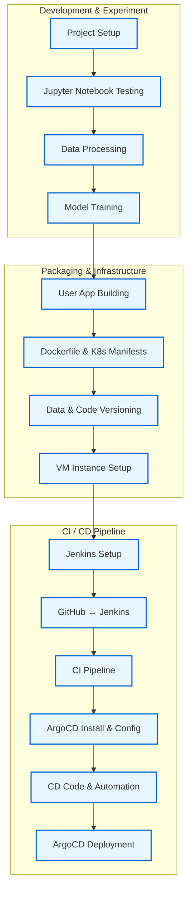

## EffiSense: End-to-End MLOps Pipeline for Machine Efficiency Prediction

EffiSense is a complete MLOps pipeline that predicts the **efficiency status (High | Medium | Low)** of industrial machines using intelligent manufacturing data.

It features a fully automated CI/CD setup using **Jenkins**, **ArgoCD**, **Docker**, **Kubernetes**, and **GitHub Webhooks** for seamless deployment.

---

## 🏛️ Project Structure
```
EffiSense/
├── app.py                  # Flask app with prediction logic
├── src/
│   ├── data_processing.py   # Preprocessing pipeline
│   ├── model_training.py    # Model training & evaluation
│   ├── logger.py
│   └── custom_exception.py
├── templates/
│   └── index.html          # Flask frontend template
├── static/
│   └── style.css           # Web UI styling
├── manifests/
│   ├── deployment.yml
│   └── service.yml
├── artifacts/
│   ├── raw/data.csv
│   ├── processed/*.pkl
│   └── models/*.pkl
├── Dockerfile
├── Jenkinsfile
└── README.md
```
---

## 🔁 Project Workflow


