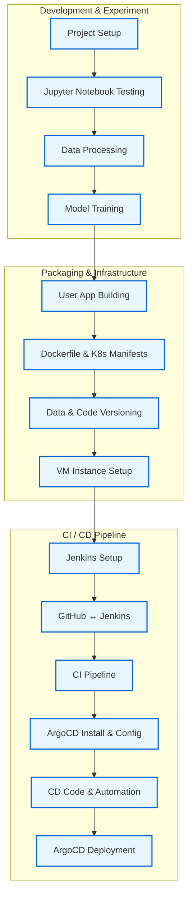

## EffiSense: End-to-End MLOps Pipeline for Machine Efficiency Prediction

EffiSense is a complete MLOps pipeline that predicts the **efficiency status (High | Medium | Low)** of industrial machines using intelligent manufacturing data.

It features a fully automated CI/CD setup using **Jenkins**, **ArgoCD**, **Docker**, **Kubernetes**, and **GitHub Webhooks** for seamless deployment.

---
## 📚 Table of Contents

- [🏛️ Project Structure](#project-structure)
- [🔁 Project Workflow](#project-workflow)
- [🛠️ Tech Stack](#tech-stack)
- [📦 Installation & Setup](#installation--setup)
- [📊 Dataset Information](#dataset-information)
  - [📁 Data Source](#data-source)
  - [🧾 Feature Overview](#feature-overview)
  - [🔍 Potential Use Cases](#potential-use-cases)
- [🤖 Model Details](#model-details)
  - [🧠 Problem Type](#problem-type)
  - [🧮 ML Pipeline Overview](#ml-pipeline-overview)
  - [💾 Saved Model Artifacts](#saved-model-artifacts)
  - [🧪 Sample Evaluation Metrics](#sample-evaluation-metrics)
- [🚀 CI/CD Pipeline](#cicd-pipeline)
  - [⚙️ 1. Development & Experimentation](#1-development--experimentation)
  - [📦 2. Packaging & Infrastructure](#2-packaging--infrastructure)
  - [🔄 3. CICD Pipeline Automation](#3-cicd-pipeline-automation)
  - [🔔 CI/CD Trigger Summary](#cicd-trigger-summary)
- [📌 Future Improvements](#future-improvements)
- [🖼️ Output Screenshots](#output-screenshots)
- [🔧 Infrastructure Setup](infra_setup.md)
- [🙌 Author](#author)
- [🤝 Contributing](#contributing)

  
---

## 🏛️ Project Structure
```
EffiSense/
│
├── src/
│   ├── data_processing.py     # Preprocessing logic
│   ├── model_training.py      # Training and evaluation
│   ├── logger.py              # Custom logger
│   └── custom_exception.py    # Custom error handler
│
├── pipeline/
│   └── training_pipeline.py   # Main ML workflow script
│
├── artifacts/
│   ├── raw/data.csv           # Input dataset
│   ├── processed/             # Scaled and encoded data
│   └── models/                # Trained model and metrics
│
├── templates/index.html       # Web UI template
├── static/style.css           # Web UI styles
├── app.py                     # Flask web app
│
├── Dockerfile                 # Docker image config
├── manifests/
│   ├── deployment.yml         # Kubernetes deployment
│   └── service.yml            # Kubernetes service
│
├── Jenkinsfile                # Jenkins CI/CD pipeline
└── README.md                  # Project documentation

```
---

## 🔁 Project Workflow



---
## 🛠️ Tech Stack

EffiSense integrates a modern MLOps toolchain combining machine learning, web app development, containerization, orchestration, and CI/CD automation.

| Layer              | Tools & Technologies                                      |
|--------------------|-----------------------------------------------------------|
| **Programming**     | Python 3.10                                               |
| **ML Libraries**    | scikit-learn, pandas, numpy, joblib                      |
| **Web Framework**   | Flask (with HTML & CSS)                                  |
| **Containerization**| Docker                                                   |
| **Orchestration**   | Kubernetes (Minikube for local)                          |
| **CI/CD**           | Jenkins, GitHub Webhooks, ArgoCD                         |
| **Infrastructure**  | GCP VM (Ubuntu 20.04, Minikube, Docker, kubectl)        |
| **Version Control** | Git + GitHub                                              |
| **Scripting & Config** | YAML, Bash                                             |

---
## 📦 Installation & Setup

EffiSense is designed for seamless local testing before deploying to production via CI/CD. Follow the steps below to run everything locally.

### 🔧 Step-by-Step Setup (Local Development)

```bash
# 1️⃣ Clone the repository
git clone https://github.com/aimldinesh/EffiSense.git
cd EffiSense

# 2️⃣ (Optional but recommended) Create and activate a virtual environment
python -m venv venv
source venv/bin/activate         # On Windows: venv\Scripts\activate

# 3️⃣ Install required dependencies
pip install -r requirements.txt

# 4️⃣ Run the Flask application
python app.py
# Then open http://localhost:5000 in your browser.

# 🧪 Optional: Run Model Training Pipeline
- To re-train the model locally and generate new artifacts:

  python pipeline/training_pipeline.py

- This will process the dataset, train the Logistic Regression model, and save updated .pkl files and evaluation metrics inside artifacts/.
```
---
## 📊 Dataset Information

This dataset provides a comprehensive simulation of data from an intelligent manufacturing environment, encompassing industrial IoT sensor readings, operational modes, 6G network performance metrics, and various production and quality control indicators.

It is designed to support research in areas such as **predictive maintenance**, **quality control**, **resource optimization**, and **real-time anomaly detection** within Industry 4.0 and 6G-enabled smart factories.


### 📁 Data Source

This is a simulated dataset representing intelligent manufacturing systems, originally hosted on **Kaggle** (by Ziya). It mimics real-world industrial sensor streams and network metrics for research and development use.

> 🔗 [Kaggle Dataset Link](https://www.kaggle.com/datasets/ziya07/intelligent-manufacturing-dataset)


### 🧾 Feature Overview

Each row represents a real-time snapshot of machine operations and production metrics. Below is a categorized summary of the key features:

| Feature                         | Description                                                       | Type        | Unit / Typical Range       |
|---------------------------------|-------------------------------------------------------------------|-------------|----------------------------|
| `Timestamp`                     | Date and time of data recording                                   | Datetime    | `YYYY-MM-DD HH:MM:SS`      |
| `Machine_ID`                    | Unique identifier for each machine                                | Integer     | 1–50                       |
| `Operation_Mode`                | Current machine state (`Idle`, `Active`, etc.)                    | Categorical | -                          |

#### 🔧 Industrial IoT Sensor Data

| Feature               | Description                                | Type    | Unit         |
|----------------------|--------------------------------------------|---------|--------------|
| `Temperature_C`       | Machine operating temperature              | Float   | °C           |
| `Vibration_Hz`        | Vibration frequency                        | Float   | Hz           |
| `Power_Consumption_kW`| Power consumed by the machine              | Float   | kW           |

#### 🌐 6G Network Performance Metrics

| Feature              | Description                                | Type    | Unit         |
|---------------------|--------------------------------------------|---------|--------------|
| `Network_Latency_ms` | Network delay for data transfer            | Float   | ms           |
| `Packet_Loss_%`      | Percentage of lost network packets         | Float   | %            |

#### 🏭 Production & Quality Control Metrics

| Feature                        | Description                          | Type    | Unit         |
|--------------------------------|--------------------------------------|---------|--------------|
| `Quality_Control_Defect_Rate_%`| Defective product rate               | Float   | %            |
| `Production_Speed_units_per_hr`| Units produced per hour              | Float   | units/hr     |
| `Predictive_Maintenance_Score` | Maintenance urgency score (0 to 1)   | Float   | -            |
| `Error_Rate_%`                 | Overall production error rate        | Float   | %            |

#### 🎯 Target Variable

| Target Feature       | Description                                          | Type        |
|----------------------|------------------------------------------------------|-------------|
| `Efficiency_Status`  | Machine efficiency label: `High`, `Medium`, `Low`   | Categorical |

---

### 🔍 Potential Use Cases

- 🔧 **Predictive Maintenance** — Anticipate machine failures or service needs
- 🧪 **Real-time Anomaly Detection** — Spot unusual operational behavior
- ✅ **Quality Control** — Minimize defect rates in manufacturing
- ⚡ **Performance Optimization** — Maximize throughput and energy efficiency
- 🌐 **Network Impact Analysis** — Assess 6G network influence on production
- 🔎 **Root Cause Analysis** — Identify sources of inefficiency or failure
- 🏭 **6G-Aware Smart Factory Systems** — Build future-ready, latency-sensitive automation

---
## 🤖 Model Details

EffiSense applies a supervised ML model to classify machine efficiency as **High**, **Medium**, or **Low** using preprocessed industrial data.

### 🧠 Problem Type
- Multiclass Classification

### 🧮 ML Pipeline Overview

1. **Data Preprocessing**
   - Encode categorical features
   - Scale numeric features using `StandardScaler`
   - Split dataset into training and test sets (80/20)

2. **Model Training**
   - Algorithm: **Logistic Regression** (scikit-learn)
   - Input: Preprocessed `X_train` and `y_train`
   - Output: `model.pkl` (final trained model)

3. **Model Evaluation**
   - Evaluated on `X_test`, `y_test`
   - Metrics: Accuracy, Precision, Recall, F1-score
   - Results saved to `evaluation_metrics.csv`
   

### 💾 Saved Model Artifacts
```
artifacts/
├── raw/
│ └── data.csv # Original dataset
├── processed/
│ ├── X_train.pkl # Processed training features
│ ├── X_test.pkl # Processed testing features
│ ├── y_train.pkl # Training labels
│ ├── y_test.pkl # Testing labels
│ └── scaler.pkl # StandardScaler object
├── models/
│ ├── model.pkl # Trained Logistic Regression model
│ └── evaluation_metrics.csv # Model evaluation metrics (CSV)

```
### 🧪 Sample Evaluation Metrics

Here are the evaluation metrics of the trained Logistic Regression model on the test dataset:

| Metric     | Value     |
|------------|-----------|
| Accuracy   | 91.66%    |
| Precision  | 91.50%    |
| Recall     | 91.66%    |
| F1-Score   | 91.56%    |
---

## 🚀 CI/CD Pipeline

EffiSense features a fully automated **CI/CD pipeline** that ensures fast, reliable, and reproducible ML model deployment. It leverages:

- 🧪 **Jenkins** for Continuous Integration (CI)  
- 🔁 **ArgoCD** for GitOps-based Continuous Deployment (CD)  
- 🌐 **GitHub Webhooks** for automatic trigger on every push  

Together, these tools enable true MLOps automation — from commit to deployment — using Docker and Kubernetes.


### ⚙️ 1. Development & Experimentation

> The ML workflow starts with experimentation, model building, and evaluation — all locally.

- 🧱 **Project Setup**: Organize modular folder and script structure  
- 🧪 **Notebook Testing**: Validate core logic in Jupyter  
- 🧹 **Data Processing**: Preprocess raw data (encoding, scaling, splitting)  
- 🧠 **Model Training**: Train Logistic Regression and evaluate metrics  


### 📦 2. Packaging & Infrastructure

> The system is containerized and made deployment-ready.

- 💻 **User App Building**: Develop Flask web UI for predictions  
- 🐳 **Dockerization**: Define `Dockerfile` to containerize the app  
- 📄 **Kubernetes Manifests**: Write `deployment.yml` and `service.yml`  
- 📁 **Versioning**: Store models and scaler as `.pkl` inside `artifacts/`  
- ☁️ **VM Setup**: Use **GCP VM** (Ubuntu 20.04) with Minikube + kubectl  


### 🔄 3. CI/CD Pipeline Automation

> The complete automation is triggered via GitHub push and executed in Jenkins and ArgoCD.

- 🔧 **Jenkins Setup**: Installed and configured on GCP VM  
- 🔗 **GitHub ↔ Jenkins Integration**: GitHub Webhooks trigger CI on push  
- 🛠️ **CI Pipeline** (`Jenkinsfile`):  
  - Pull latest code  
  - Build Docker image  
  - Run lint/test scripts  
  - Push image to DockerHub/GCR  
- 🚀 **ArgoCD Setup**: Installed in Kubernetes cluster via Minikube  
- 🔁 **CD Process**:  
  - ArgoCD monitors Git for manifest changes  
  - On detecting a new image or config update, it syncs automatically  
  - App is deployed to Kubernetes within seconds  


### 🔔 CI/CD Trigger Summary

> ✅ **Trigger:** A `git push` to the `main` branch activates the Jenkins CI pipeline via webhook.  
> 🔁 **Deployment:** Updated Kubernetes manifests are pulled and deployed by ArgoCD automatically.

---
## 📌 Future Improvements

Here are a few planned enhancements and stretch goals to take EffiSense to the next level:

- 🔍 **Monitoring Integration**: Add Prometheus + Grafana for real-time app and model monitoring
- 📈 **Model Experiment Tracking**: Integrate MLflow or DVC to track model performance and metadata
- 🧪 **AutoML Pipeline**: Extend model training to support multiple algorithms + hyperparameter tuning
- 📊 **Analytics Dashboard**: Build a Streamlit-based dashboard to visualize efficiency trends
- 🔐 **Authentication**: Add user login and access control to the web interface
- ☁️ **Cloud-Native Deployment**: Move from local Minikube to managed GKE/EKS cluster

---
## 🖼️ Output Screenshots

A visual overview of EffiSense in action — from CI/CD to deployment to prediction UI.

---

### ✅ Jenkins – Build Triggered and Completed

| Jenkins Build Started | Jenkins Build Successful |
|-----------------------|--------------------------|
|  |  |

> 🛠️ Jenkins monitors the GitHub repo via Webhooks and automatically starts the build process on each push.  
> ✅ The pipeline includes testing, Docker image build, and pushing to the container registry.

---

### 🚀 ArgoCD – GitOps Deployment


> 📦 ArgoCD continuously watches for changes in the Kubernetes manifests stored in the Git repo.  
> 🔄 On update, it automatically syncs the desired state with the actual state in the Kubernetes cluster.  
> 🎯 This enables **automated and declarative deployment** with complete GitOps control.

---

### 🔍 Kubernetes Pod Logs – Flask App Running


> 🧵 This log output confirms that the **Flask app is running inside a Kubernetes pod** with debug mode enabled.  
> 🌐 It is exposed through a Kubernetes Service and accessible via its internal or external IP.

---

### 🖥️ Web Application – Prediction UI


> 🧠 This is the deployed **Flask web interface** where users can input machine metrics.  
> 📊 The app predicts machine efficiency in real-time using the trained model.  
> ⚙️ Hosted inside a container, deployed via ArgoCD, and running in the Kubernetes cluster.

# 📄 License
This project is licensed under the MIT License – see the LICENSE file for details.
