## EffiSense: End-to-End MLOps Pipeline for Machine Efficiency Prediction

EffiSense is a complete MLOps pipeline that predicts the **efficiency status (High | Medium | Low)** of industrial machines using intelligent manufacturing data.

It features a fully automated CI/CD setup using **Jenkins**, **ArgoCD**, **Docker**, **Kubernetes**, and **GitHub Webhooks** for seamless deployment.

---

## 🏛️ Project Structure
```
EffiSense/
├── app.py                  # Flask app with prediction logic
├── src/
│   ├── data_processing.py   # Preprocessing pipeline
│   ├── model_training.py    # Model training & evaluation
│   ├── logger.py
│   └── custom_exception.py
├── templates/
│   └── index.html          # Flask frontend template
├── static/
│   └── style.css           # Web UI styling
├── manifests/
│   ├── deployment.yml
│   └── service.yml
├── artifacts/
│   ├── raw/data.csv
│   ├── processed/*.pkl
│   └── models/*.pkl
├── Dockerfile
├── Jenkinsfile
└── README.md
```
---

## 🔁 Project Workflow

```mermaid
%% EffiSense MLOps Workflow (3-row layout)
flowchart TB
    %% ──────────────── 1️⃣ Development & Experimentation ────────────────
    subgraph DEV [Development & Experiment]
        direction LR
        A[Project Setup] --> B[Jupyter Notebook Testing] --> C[Data Processing] --> D[Model Training]
    end

    %% ──────────────── 2️⃣ Packaging & Infrastructure ────────────────
    subgraph PKG [Packaging & Infrastructure]
        direction LR
        D --> E[User App Building] --> F[Dockerfile & K8s Manifests] --> G[Data & Code Versioning] --> H[VM Instance Setup]
    end

    %% ──────────────── 3️⃣ CI / CD Pipeline ────────────────
    subgraph CICD [CI / CD Pipeline]
        direction LR
        H --> I[Jenkins Setup] --> J[GitHub ↔ Jenkins] --> K[CI Pipeline] --> L[ArgoCD Install & Config] --> M[CD Code & Automation] --> N[ArgoCD Deployment]
    end

    %% Optional style tweaks (colors, borders)
    classDef stage fill:#E8F7FF,stroke:#0366D6,stroke-width:2px;
    class A,B,C,D,E,F,G,H,I,J,K,L,M,N stage;
```



---
## 🛠️ Tech Stack

EffiSense integrates a modern MLOps toolchain combining machine learning, web app development, containerization, orchestration, and CI/CD automation.

| Layer              | Tools & Technologies                                      |
|--------------------|-----------------------------------------------------------|
| **Programming**     | Python 3.10                                               |
| **ML Libraries**    | scikit-learn, pandas, numpy, joblib                      |
| **Web Framework**   | Flask (with HTML & CSS)                                  |
| **Containerization**| Docker                                                   |
| **Orchestration**   | Kubernetes (Minikube for local)                          |
| **CI/CD**           | Jenkins, GitHub Webhooks, ArgoCD                         |
| **Infrastructure**  | GCP VM (Ubuntu 20.04, Minikube, Docker, kubectl)        |
| **Version Control** | Git + GitHub                                              |
| **Scripting & Config** | YAML, Bash                                             |

---
