## EffiSense: End-to-End MLOps Pipeline for Machine Efficiency Prediction

EffiSense is a complete MLOps pipeline that predicts the **efficiency status (High | Medium | Low)** of industrial machines using intelligent manufacturing data.

It features a fully automated CI/CD setup using **Jenkins**, **ArgoCD**, **Docker**, **Kubernetes**, and **GitHub Webhooks** for seamless deployment.

---
## 📚 Table of Contents

- [🏛️ Project Structure](#-project-structure)
- [🔁 Project Workflow](#-project-workflow)
- [🛠️ Tech Stack](#-tech-stack)
- [📦 Installation & Setup](#-installation--setup)
- [🤖 Model Details](#-model-details)
- [🚀 CI/CD Pipeline](#-cicd-pipeline)
- [📌 Future Improvements](#-future-improvements)
- [🙌 Author](#-author)
- [🤝 Contributing](#-contributing)

---

## 🏛️ Project Structure
```
EffiSense/
├── app.py                  # Flask app with prediction logic
├── src/
│   ├── data_processing.py   # Preprocessing pipeline
│   ├── model_training.py    # Model training & evaluation
│   ├── logger.py
│   └── custom_exception.py
├── templates/
│   └── index.html          # Flask frontend template
├── static/
│   └── style.css           # Web UI styling
├── manifests/
│   ├── deployment.yml
│   └── service.yml
├── artifacts/
│   ├── raw/data.csv
│   ├── processed/*.pkl
│   └── models/*.pkl
├── Dockerfile
├── Jenkinsfile
└── README.md
```
---

## 🔁 Project Workflow

```mermaid
%% EffiSense MLOps Workflow (3-row layout)
flowchart TB
    %% ──────────────── 1️⃣ Development & Experimentation ────────────────
    subgraph DEV [Development & Experiment]
        direction LR
        A[Project Setup] --> B[Jupyter Notebook Testing] --> C[Data Processing] --> D[Model Training]
    end

    %% ──────────────── 2️⃣ Packaging & Infrastructure ────────────────
    subgraph PKG [Packaging & Infrastructure]
        direction LR
        D --> E[User App Building] --> F[Dockerfile & K8s Manifests] --> G[Data & Code Versioning] --> H[VM Instance Setup]
    end

    %% ──────────────── 3️⃣ CI / CD Pipeline ────────────────
    subgraph CICD [CI / CD Pipeline]
        direction LR
        H --> I[Jenkins Setup] --> J[GitHub ↔ Jenkins] --> K[CI Pipeline] --> L[ArgoCD Install & Config] --> M[CD Code & Automation] --> N[ArgoCD Deployment]
    end

    %% Optional style tweaks (colors, borders)
    classDef stage fill:#E8F7FF,stroke:#0366D6,stroke-width:2px;
    class A,B,C,D,E,F,G,H,I,J,K,L,M,N stage;
```



---
## 🛠️ Tech Stack

EffiSense integrates a modern MLOps toolchain combining machine learning, web app development, containerization, orchestration, and CI/CD automation.

| Layer              | Tools & Technologies                                      |
|--------------------|-----------------------------------------------------------|
| **Programming**     | Python 3.10                                               |
| **ML Libraries**    | scikit-learn, pandas, numpy, joblib                      |
| **Web Framework**   | Flask (with HTML & CSS)                                  |
| **Containerization**| Docker                                                   |
| **Orchestration**   | Kubernetes (Minikube for local)                          |
| **CI/CD**           | Jenkins, GitHub Webhooks, ArgoCD                         |
| **Infrastructure**  | GCP VM (Ubuntu 20.04, Minikube, Docker, kubectl)        |
| **Version Control** | Git + GitHub                                              |
| **Scripting & Config** | YAML, Bash                                             |

---
## 📦 Installation & Setup

### 🔧 Local Development

```bash
# 1. Clone the repository
git clone https://github.com/aimldinesh/EffiSense.git
cd EffiSense

# 2. (Optional) Create a virtual environment
python -m venv venv
source venv/bin/activate  # On Windows: venv\Scripts\activate

# 3. Install dependencies
pip install -r requirements.txt

# 4. Run the Flask app
python app.py
# Then open http://localhost:5000 in your browser.
```
---
## 🤖 Model Details

EffiSense applies a supervised ML model to classify machine efficiency as **High**, **Medium**, or **Low** using preprocessed industrial data.

### 🧠 Problem Type
- Multiclass Classification

### 🧮 ML Pipeline Overview

1. **Data Preprocessing**
   - Encode categorical features
   - Scale numeric features using `StandardScaler`
   - Split dataset into training and test sets (80/20)

2. **Model Training**
   - Algorithm: **Logistic Regression** (scikit-learn)
   - Input: Preprocessed `X_train` and `y_train`
   - Output: `model.pkl` (final trained model)

3. **Model Evaluation**
   - Evaluated on `X_test`, `y_test`
   - Metrics: Accuracy, Precision, Recall, F1-score
   - Results saved to `evaluation_metrics.csv`

### 📁 Model Artifacts
```
artifacts/
├── raw/
│ └── data.csv # Original dataset
├── processed/
│ ├── X_train.pkl # Processed training features
│ ├── X_test.pkl # Processed testing features
│ ├── y_train.pkl # Training labels
│ ├── y_test.pkl # Testing labels
│ └── scaler.pkl # StandardScaler object
├── models/
│ ├── model.pkl # Trained Logistic Regression model
│ └── evaluation_metrics.csv # Model evaluation metrics (CSV)

```
---

## 🚀 CI/CD Pipeline

EffiSense uses a robust CI/CD pipeline to automate the build, test, and deployment process using **Jenkins** and **ArgoCD**.

The pipeline is divided into three major phases as shown in the MLOps workflow:

---

### ⚙️ 1. Development & Experimentation

- **Project Setup**: Organize codebase and folder structure
- **Notebook Testing**: Validate logic using Jupyter notebooks
- **Data Processing**: Handle preprocessing, encoding, scaling
- **Model Training**: Train and evaluate ML model

---

### 📦 2. Packaging & Infrastructure

- **User App Building**: Develop Flask app for prediction
- **Dockerfile & K8s Manifests**: Create deployment-ready infrastructure files
- **Data & Code Versioning**: Store models and preprocessing artifacts in versioned directories
- **VM Instance Setup**: Use GCP VM with Minikube to simulate production environment

---

### 🔄 3. CI/CD Pipeline Automation

- **Jenkins Setup**: Jenkins is installed and configured on the VM
- **GitHub ↔ Jenkins Integration**: GitHub Webhooks trigger Jenkins on every push
- **CI Pipeline**: Jenkins runs `Jenkinsfile` to build Docker image and run tests
- **ArgoCD Setup**: ArgoCD is installed on the cluster for GitOps-based deployment
- **CD Code & Automation**: ArgoCD monitors Git repo for Kubernetes manifest changes
- **Production Deployment**: New app version is automatically deployed to K8s via ArgoCD
  
> ✅ This setup ensures that **every code push** is automatically tested, containerized, and deployed to the cluster within seconds — achieving true MLOps automation.
---
## 📌 Future Improvements

Here are a few planned enhancements and stretch goals to take EffiSense to the next level:

- 🔍 **Monitoring Integration**: Add Prometheus + Grafana for real-time app and model monitoring
- 📈 **Model Experiment Tracking**: Integrate MLflow or DVC to track model performance and metadata
- 🧪 **AutoML Pipeline**: Extend model training to support multiple algorithms + hyperparameter tuning
- 📊 **Analytics Dashboard**: Build a Streamlit-based dashboard to visualize efficiency trends
- 🔐 **Authentication**: Add user login and access control to the web interface
- ☁️ **Cloud-Native Deployment**: Move from local Minikube to managed GKE/EKS cluster

---
## 🙌 Author

**Dinesh Kumar**  
- 🧑‍💻 [GitHub](https://github.com/aimldinesh)  
- 📝 [Medium](https://medium.com/@aimldinesh)  
- 📫 Email: aimldinesh@gmail.com

> If you found this project useful or learned something from it, feel free to ⭐ the repo and connect!

---

## 🤝 Contributing

Contributions, issues, and feature requests are welcome!  
Feel free to `fork` the repository and submit a `pull request`.


